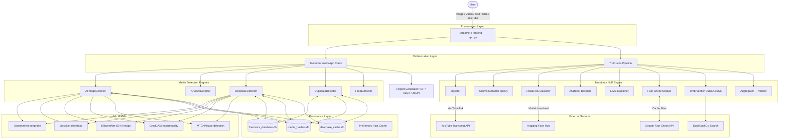
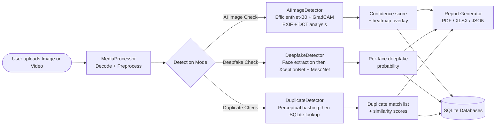
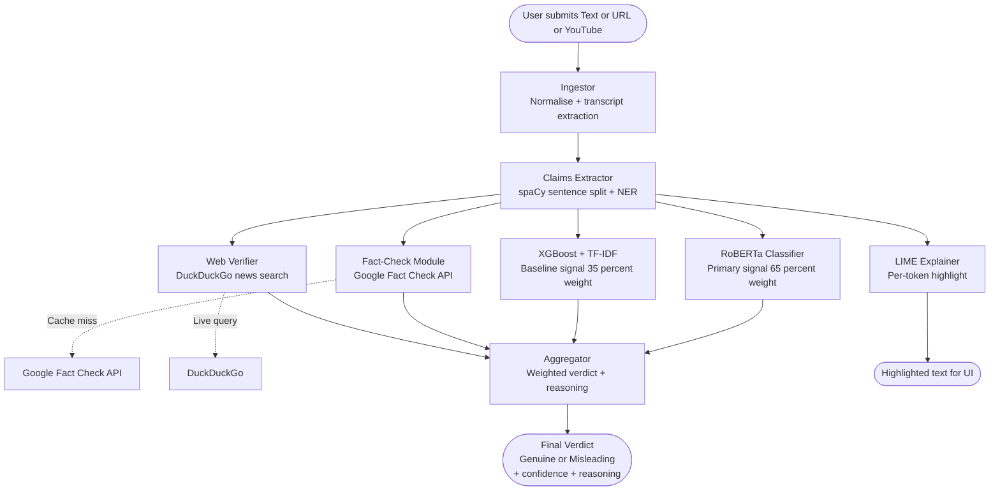
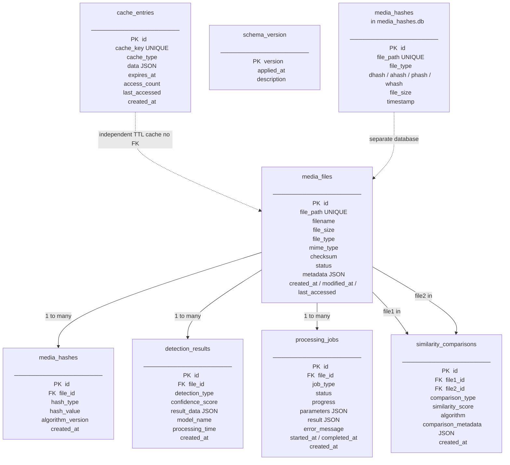

# TrueLens — Comprehensive Project Documentation

> **TrueLens** is an AI-powered media forensics and fake news detection platform built with Streamlit.  
> It combines computer-vision deepfake/AI-image detection with NLP-based misinformation analysis.

---

## Table of Contents

1. [Project Overview](#1-project-overview)
2. [Architecture](#2-architecture)
   - [High-Level Architecture](#21-high-level-architecture)
   - [Layer Breakdown](#22-layer-breakdown)
3. [Module Reference](#3-module-reference)
4. [Data Flow](#4-data-flow)
   - [Media Forensics Flow](#41-media-forensics-flow)
   - [Fake News (TruthLens) Flow](#42-fake-news-truthlens-flow)
5. [Database Schema](#5-database-schema)
6. [ER Diagram](#6-er-diagram)
7. [Configuration & Environment Variables](#7-configuration--environment-variables)
8. [Dependencies](#8-dependencies)
9. [Running the Project](#9-running-the-project)

---

## 1. Project Overview

TrueLens operates in **two major modes**, selectable from the sidebar:

| Mode | Description |
|---|---|
| **Media Forensics** | Detects AI-generated images, deepfake videos, and duplicate media using CV models |
| **Fake News Detector (TruthLens)** | Analyses text, URLs, or YouTube videos for misinformation using NLP |

---

## 2. Architecture

### 2.1 High-Level Architecture



---

### 2.2 Layer Breakdown

| Layer | Files / Packages | Responsibility |
|---|---|---|
| **Presentation** | `app.py` | Streamlit UI, routing between modes, CSS theming |
| **Orchestration** | `app.py::MediaForensicsApp`, `truthlens/` pipeline | Wires detectors, manages session state |
| **Detection — CV** | `detection/` | AI image, AI video, deepfake, duplicate, face detection |
| **Detection — NLP** | `truthlens/` | Ingest → extract claims → BERT → XGB → LIME → fact-check → web → aggregate |
| **ML Models** | `models/` | XceptionNet & MesoNet architecture definitions |
| **Utilities** | `utils/` | Media processing, batch processing, model manager, error handler, visualization |
| **Database** | `database/` | Schema management, hash storage, similarity cache, file manager |
| **Reports** | `reports/` | PDF, Excel, JSON export; batch processing; analysis summaries |
| **Configuration** | `settings.py`, `config_manager.py`, `.env` | Thresholds, paths, logging, user preferences |

---

## 3. Module Reference

### `detection/` — Computer Vision Detectors

| File | Class | Purpose |
|---|---|---|
| `ai_image_detector.py` | `AIImageDetector` | Detects AI-generated images using EfficientNet-B0 + GradCAM; analyses EXIF metadata, colour distributions, DCT frequency patterns |
| `ai_video_detector.py` | `AIVideoDetector` | Frame-by-frame AI-generation detection on video |
| `deepfake_detector.py` | `DeepfakeDetector` | Face-extraction → XceptionNet + MesoNet ensemble for deepfake classification; memory-aware batch processing |
| `duplicate_detector.py` | `DuplicateDetector`, `DatabaseManager` | Perceptual hashing (dHash, aHash, pHash, wHash) stored in SQLite for duplicate/near-duplicate detection |
| `face_extractor.py` | `FaceExtractor` | MTCNN + dlib face detection and landmark extraction |

### `models/` — Neural Network Architectures

| File | Function | Purpose |
|---|---|---|
| `xception_net.py` | `load_xception_model()` | Loads fine-tuned XceptionNet (PyTorch); falls back to pretrained `timm` variant |
| `meso_net.py` | `load_meso_model()` | Loads MesoNet4 (lightweight CNN) for fast deepfake screening |

### `truthlens/` — NLP Fake News Pipeline

| File | Key Export | Purpose |
|---|---|---|
| `ingestor.py` | `ingest()` | Normalises raw text, URL content, or YouTube transcripts |
| `claims.py` | `extract_claims()` | Sentence segmentation + spaCy NER to isolate verifiable claims |
| `classifier.py` | `bert_classify()` | RoBERTa inference (primary: `hamzab/roberta-fake-news-classification`, fallback: `bert-base-uncased`) |
| `baseline.py` | `train_xgb_pipeline()` | TF-IDF + XGBoost trained on 80 labelled examples (genuine / misleading) |
| `explainer.py` | `get_explainer()` | LIME text explainer for per-token highlighting |
| `fact_check.py` | `fact_check()` | In-memory cache → Google Fact Check API lookup |
| `web_verify.py` | `web_verify_claims()` | DuckDuckGo news + text search for live corroboration |
| `aggregator.py` | `compute_final_verdict()` | Weighted fusion: BERT (65%) + XGB (35%) + fact-check boost |
| `logging_config.py` | `get_logger()` | Shared logger factory |

### `database/` — Persistence Layer

| File | Class | Purpose |
|---|---|---|
| `schema_manager.py` | `SchemaManager` | SQLite schema creation, versioning, validation for `forensics_database.db` |
| `hash_storage.py` | `HashStorage` | CRUD for `media_hashes` table (md5, sha256, perceptual hashes) |
| `similarity_cache.py` | `SimilarityCache` | Stores/retrieves pairwise similarity scores to avoid re-computation |
| `file_manager.py` | `FileManager` | Media file registry CRUD against `media_files` table |
| `mock_database.py` | `MockDatabase` | In-memory test fixture replicating the real schema |

### `utils/` — Shared Utilities

| File | Class/Function | Purpose |
|---|---|---|
| `media_processor.py` | `MediaProcessor` | Image/video decode, EXIF extraction, resize, colour-space conversion |
| `model_manager.py` | `ModelManager` | LRU model cache with memory-aware eviction |
| `batch_processor.py` | `MemoryAwareBatchProcessor` | Chunked batch processing respecting RAM limits |
| `error_handler.py` | `ErrorHandler` | Unified exception capture, retry logic |
| `visualization.py` | `create_result_card()`, `create_confidence_chart()` | Plotly chart generation |

### `reports/` — Export & Reporting

| File | Class | Purpose |
|---|---|---|
| `advanced_pdf_generator.py` | `AdvancedPDFGenerator` | ReportLab PDF with charts, result cards, EXIF tables |
| `analysis_summary.py` | `AnalysisSummaryGenerator` | Structured JSON/dict summary of an analysis session |
| `technical_exporter.py` | `TechnicalDetailsExporter` | XLSX/CSV technical data export |
| `advanced_batch_processor.py` | `AdvancedBatchProcessor` | Batch file processing with progress tracking |

---

## 4. Data Flow

### 4.1 Media Forensics Flow



### 4.2 Fake News (TruthLens) Flow



---

## 5. Database Schema

TrueLens uses **three SQLite databases**:

| Database File | Owner | Purpose |
|---|---|---|
| `forensics_database.db` | `SchemaManager` / `FileManager` / `HashStorage` | Central forensics store |
| `media_hashes.db` | `DuplicateDetector::DatabaseManager` | Perceptual hash index for duplicate detection |
| `deepfake_cache.db` | `DeepfakeDetector` → `SimilarityCache` | Cached deepfake inference results |

---

### `forensics_database.db` — Full Schema (v1.0.0)

#### Table: `media_files`
Stores metadata for every media file registered for analysis.

| Column | Type | Constraints | Description |
|---|---|---|---|
| `id` | INTEGER | PK, AUTOINCREMENT | Surrogate key |
| `file_path` | TEXT | UNIQUE, NOT NULL | Absolute or relative file path |
| `filename` | TEXT | NOT NULL | Basename of the file |
| `file_size` | INTEGER | NOT NULL | File size in bytes |
| `file_type` | TEXT | NOT NULL | `image`, `video`, `audio` |
| `mime_type` | TEXT | — | MIME type string |
| `created_at` | TIMESTAMP | DEFAULT NOW | Row creation time |
| `modified_at` | TIMESTAMP | DEFAULT NOW | Last modification time |
| `last_accessed` | TIMESTAMP | DEFAULT NOW | Last access time |
| `metadata` | TEXT | — | JSON blob (EXIF, codec, fps, etc.) |
| `checksum` | TEXT | — | SHA-256 cryptographic hash |
| `status` | TEXT | DEFAULT `'active'` | `active` / `deleted` / `moved` |

---

#### Table: `media_hashes`
Stores one or more hash values per media file (multiple hash types supported).

| Column | Type | Constraints | Description |
|---|---|---|---|
| `id` | INTEGER | PK, AUTOINCREMENT | Surrogate key |
| `file_id` | INTEGER | FK → `media_files.id` CASCADE | Parent file |
| `hash_type` | TEXT | NOT NULL | `md5`, `sha1`, `sha256`, `sha512`, `perceptual`, `dhash`, `phash`, `ahash`, `whash` |
| `hash_value` | TEXT | NOT NULL | Hex hash string |
| `algorithm_version` | TEXT | — | Version of hashing algorithm used |
| `created_at` | TIMESTAMP | DEFAULT NOW | Hash computation time |

> **Unique constraint:** `(file_id, hash_type)`

---

#### Table: `similarity_comparisons`
Stores pairwise similarity scores to avoid redundant computation.

| Column | Type | Constraints | Description |
|---|---|---|---|
| `id` | INTEGER | PK, AUTOINCREMENT | Surrogate key |
| `file1_id` | INTEGER | FK → `media_files.id` CASCADE | First file in comparison |
| `file2_id` | INTEGER | FK → `media_files.id` CASCADE | Second file in comparison |
| `comparison_type` | TEXT | NOT NULL | `perceptual`, `structural`, `semantic` |
| `similarity_score` | REAL | NOT NULL | 0.0 → 1.0 |
| `algorithm` | TEXT | NOT NULL | Algorithm name (e.g. `phash`, `ssim`) |
| `algorithm_version` | TEXT | — | Version string |
| `comparison_metadata` | TEXT | — | JSON with per-channel scores etc. |
| `created_at` | TIMESTAMP | DEFAULT NOW | Computation time |

> **Unique constraint:** `(file1_id, file2_id, comparison_type, algorithm)`

---

#### Table: `detection_results`
Stores AI/deepfake/duplicate detection outcomes per file.

| Column | Type | Constraints | Description |
|---|---|---|---|
| `id` | INTEGER | PK, AUTOINCREMENT | Surrogate key |
| `file_id` | INTEGER | FK → `media_files.id` CASCADE | Analysed file |
| `detection_type` | TEXT | NOT NULL | `ai_generated`, `deepfake`, `duplicate` |
| `confidence_score` | REAL | NOT NULL | 0.0 → 1.0 model confidence |
| `result_data` | TEXT | — | JSON full result payload |
| `model_name` | TEXT | — | Model identifier (e.g. `xception_net`) |
| `model_version` | TEXT | — | Model version |
| `processing_time` | REAL | — | Inference time in seconds |
| `created_at` | TIMESTAMP | DEFAULT NOW | Analysis timestamp |

---

#### Table: `cache_entries`
Generic TTL cache for hash, similarity, and detection results.

| Column | Type | Constraints | Description |
|---|---|---|---|
| `id` | INTEGER | PK, AUTOINCREMENT | Surrogate key |
| `cache_key` | TEXT | UNIQUE, NOT NULL | Lookup key (hash of inputs) |
| `cache_type` | TEXT | NOT NULL | `hash`, `similarity`, `detection` |
| `data` | TEXT | NOT NULL | JSON cached payload |
| `expires_at` | TIMESTAMP | — | Expiry time (NULL = no expiry) |
| `created_at` | TIMESTAMP | DEFAULT NOW | Cache entry creation |
| `last_accessed` | TIMESTAMP | DEFAULT NOW | Last retrieval time |
| `access_count` | INTEGER | DEFAULT 1 | Hit counter |

---

#### Table: `processing_jobs`
Tracks asynchronous analysis jobs.

| Column | Type | Constraints | Description |
|---|---|---|---|
| `id` | INTEGER | PK, AUTOINCREMENT | Surrogate key |
| `job_type` | TEXT | NOT NULL | `hash_generation`, `similarity_check`, `detection` |
| `file_id` | INTEGER | FK → `media_files.id` CASCADE | Target file (nullable for batch jobs) |
| `status` | TEXT | DEFAULT `'pending'` | `pending`, `running`, `completed`, `failed` |
| `progress` | REAL | DEFAULT 0.0 | 0.0 → 1.0 progress fraction |
| `parameters` | TEXT | — | JSON job parameters |
| `result` | TEXT | — | JSON job result |
| `error_message` | TEXT | — | Error details on failure |
| `started_at` | TIMESTAMP | — | Job start time |
| `completed_at` | TIMESTAMP | — | Job completion time |
| `created_at` | TIMESTAMP | DEFAULT NOW | Job enqueue time |

---

#### Table: `schema_version`
Schema migration tracking.

| Column | Type | Constraints | Description |
|---|---|---|---|
| `version` | TEXT | PK | Semantic version string e.g. `1.0.0` |
| `applied_at` | TIMESTAMP | DEFAULT NOW | Migration timestamp |
| `description` | TEXT | — | Human-readable migration note |

---

### `media_hashes.db` — Duplicate Detection Schema

#### Table: `media_hashes` (Duplicate Detector)
Flat hash table used exclusively by `DuplicateDetector`.

| Column | Type | Constraints | Description |
|---|---|---|---|
| `id` | INTEGER | PK, AUTOINCREMENT | Surrogate key |
| `file_path` | TEXT | UNIQUE, NOT NULL | Path to the media file |
| `file_type` | TEXT | NOT NULL | `image`, `video` |
| `dhash` | TEXT | NOT NULL | Difference hash |
| `ahash` | TEXT | NOT NULL | Average hash |
| `phash` | TEXT | NOT NULL | Perceptual hash |
| `whash` | TEXT | NOT NULL | Wavelet hash |
| `file_size` | INTEGER | NOT NULL | File size in bytes |
| `timestamp` | TEXT | NOT NULL | ISO 8601 insertion timestamp |

---

## 6. ER Diagram



---

## 7. Configuration & Environment Variables

All settings live in `settings.py` (`Config` class) and can be overridden via a `.env` file (see `.env.example`).

### Detection Thresholds

| Variable | Default | Description |
|---|---|---|
| `CONFIDENCE_THRESHOLD` | `0.51` | General confidence cutoff |
| `AI_IMAGE_THRESHOLD` | `0.60` | AI-generated image flag threshold |
| `DEEPFAKE_THRESHOLD` | `0.70` | Deepfake flag threshold |
| `DUPLICATE_THRESHOLD` | `0.80` | Duplicate similarity threshold |

### Model Paths

| Variable | Default | Description |
|---|---|---|
| `MODEL_BASE_DIR` | `models/` | Base directory for all model files |
| `XCEPTION_MODEL_PATH` | `models/xception_net.pth` | Fine-tuned XceptionNet weights |
| `MESO_MODEL_PATH` | `models/meso_net.pth` | MesoNet4 weights |
| `EFFICIENTNET_MODEL_PATH` | `models/efficientnet_b0.pth` | EfficientNet-B0 weights |
| `MTCNN_MODEL_PATH` | `models/mtcnn/` | MTCNN face detector |

### Storage Paths

| Variable | Default | Description |
|---|---|---|
| `DATABASE_PATH` | `forensics_database.db` | Main SQLite database |
| `REPORTS_OUTPUT_DIR` | `reports/` | Report output directory |
| `TEMP_UPLOAD_DIR` | `temp_uploads/` | Temporary file upload directory |
| `PREFERENCES_STORAGE_PATH` | `user_preferences.json` | User preference persistence |

### UI Settings

| Variable | Default | Description |
|---|---|---|
| `ENABLE_VISUALIZATION` | `True` | Show GradCAM heatmaps |
| `SAVE_RESULTS` | `False` | Auto-save results to disk |
| `ENABLE_WEBCAM` | `True` | Enable webcam capture mode |
| `UI_THEME` | `light` | UI theme |
| `SHOW_TECHNICAL_DETAILS` | `True` | Show model scores & metadata |

### External API Keys

| Variable | Required | Description |
|---|---|---|
| `GOOGLE_API_KEY` | Optional | Enables live Google Fact Check API lookups |

---

## 8. Dependencies

### Core Runtime

| Package | Purpose |
|---|---|
| `streamlit` | Web UI framework |
| `torch` / `torchvision` | PyTorch deep learning runtime |
| `tensorflow` | TensorFlow (auxiliary models) |
| `opencv-python` | Image/video processing |
| `Pillow` | Image I/O and manipulation |
| `numpy` | Numerical computing |

### Computer Vision

| Package | Purpose |
|---|---|
| `timm` | Pre-trained model library (XceptionNet, EfficientNet) |
| `facenet-pytorch` | FaceNet embeddings |
| `mtcnn` | Face detection |
| `imagehash` | Perceptual hashing (pHash, dHash, aHash, wHash) |
| `scikit-image` | Image quality metrics (SSIM, DCT) |
| `scipy` | Signal processing |
| `efficientnet-pytorch` | EfficientNet architecture |
| `moviepy` | Video frame extraction |

### NLP / Fake News

| Package | Purpose |
|---|---|
| `transformers` | Hugging Face — RoBERTa / BERT models |
| `spacy` | NLP pipeline, NER, sentence segmentation |
| `xgboost` | XGBoost baseline classifier |
| `scikit-learn` | TF-IDF vectorizer, pipeline utilities |
| `lime` | LIME text explainability |
| `youtube-transcript-api` | YouTube video transcript extraction |
| `ddgs` | DuckDuckGo search client |
| `requests` | HTTP client (Fact Check API) |
| `python-dotenv` | `.env` file loading |

### Reporting

| Package | Purpose |
|---|---|
| `reportlab` | PDF generation |
| `fpdf2` | Alternative PDF backend |
| `jinja2` | HTML template rendering |
| `weasyprint` | HTML → PDF rendering |
| `pandas` | Data manipulation |
| `openpyxl` / `xlsxwriter` | Excel export |
| `seaborn` / `matplotlib` | Statistical chart generation |
| `plotly` | Interactive charts in Streamlit |

### System

| Package | Purpose |
|---|---|
| `psutil` | Memory / CPU usage monitoring |
| `exifread` | EXIF metadata extraction |

---

## 9. Running the Project

### Prerequisites

```bash
# Python 3.9+
pip install -r requirements.txt

# Download spaCy language model
python -m spacy download en_core_web_sm
```

### Environment Setup

```bash
cp .env.example .env
# Edit .env — set GOOGLE_API_KEY for live fact-checking (optional)
```

### Launch

```bash
streamlit run app.py
```

The app will open at **http://localhost:8501**.

### Mode Selection

Use the **sidebar** to switch between:

| Sidebar Option | Description |
|---|---|
| AI Image Detection | Upload an image to detect AI generation |
| Deepfake Detection | Upload a video or face-containing image |
| Duplicate Detection | Upload one or more media files to check for duplicates |
| Fake News Detection | Paste text, a URL, or a YouTube link |

### Running Tests

```bash
pytest                           # all tests
python run_tests.py              # custom runner with detailed output
pytest test_ai_detection.py      # specific test file
pytest test_duplicate_detection.py
pytest test_configuration.py
```

---

*Documentation generated: 2026-06-30 | Schema version: 1.0.0*
